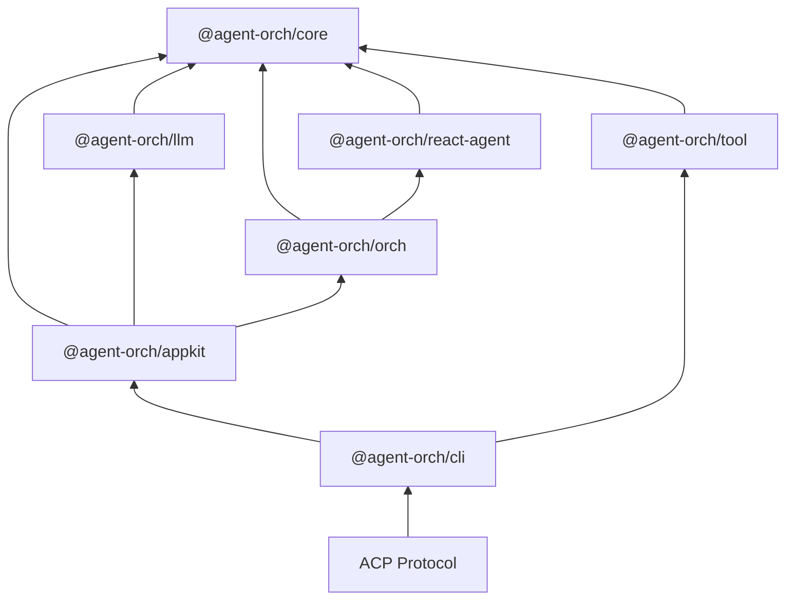

# Agent Orch 🎭

[](https://github.com/IanYu-Tree/agent-orch/actions)
[](./LICENSE)
[](https://nodejs.org)
[](https://www.typescriptlang.org)
[](https://agentclientprotocol.com)

**A powerful orchestration framework for AI Agents — unifying LLMs, tools, and collaboration patterns under one control plane. Now with full [ACP (Agent Client Protocol)](https://agentclientprotocol.com) support for seamless IDE integration!**

English | [简体中文](./README.zh-CN.md)

---

## ✨ Why Agent Orch?

- **🚀 IDE-Native Experience** — Full ACP protocol support brings your agents directly into VS Code, Cursor, and any ACP-compatible IDE
- **🔧 Build from scratch** — Use it to easily implement the agent orchestration layer, enabling lower-cost and higher-quality Agent Orch engineering
- **🧩 Atomic design** — Packages like LLM, ReAct Agent, and Tool can be used independently. Start simple, compose as you grow
- **🏢 Business-adaptive** — Different businesses need different harnesses. Flexible orchestration nesting lets you build the orch that fits your use case

---

## 🎯 What's New: ACP Protocol Support

Agent Orch now implements the **[Agent Client Protocol (ACP)](https://agentclientprotocol.com)** — an open standard for AI agent integration with IDEs.

### What does this mean?

```bash
# Start the ACP server and connect your IDE!
npx @agent-orch/cli acp
```

Your agents can now:
- 💬 Chat directly within VS Code / Cursor / Windsurf
- 🔧 Execute tools with user confirmation
- 📁 Access workspace files seamlessly
- 🔄 Stream responses in real-time
- 💾 Persist sessions across conversations

### Quick ACP Setup

```bash
# Install the CLI
npm install -g @agent-orch/cli

# Configure your LLM provider
mkdir -p ~/.agent-orch
cat > ~/.agent-orch/.agent-orch.json << 'EOF'
{
  "llm": {
    "apiKey": "your-api-key",
    "modelId": "openai/gpt-4o"
  },
  "defaultOrchId": "single"
}
EOF

# Start ACP server (stdio mode for IDE)
npx @agent-orch/cli acp

# Or HTTP mode for web clients
npx @agent-orch/cli acp --http --port=3000
```

### Custom Orchestrations via Config

```json
{
  "llm": { "apiKey": "sk-...", "modelId": "openai/gpt-4o" },
  "defaultOrchId": "custom",
  "orchs": [
    { "id": "single", "path": "./my-orchs/single-agent.ts" },
    { "id": "team", "path": "./my-orchs/team-orch.ts" }
  ]
}
```

Your orchestrations are automatically loaded on startup! No code changes needed.

---

## 🚀 Features

### Core Capabilities
- **3 Orchestration Patterns** — SingleAgent, PlannerExecutor, and Reflexion
- **Streaming Event System** — 16 event types delivered via `AsyncGenerator`
- **Pluggable Tool System** — Tool definitions with Zod schema validation
- **LLM Provider Abstraction** — Swappable provider layer (OpenAI, Anthropic, etc.)
- **Recursive Nested Orchestration** — Compose orchestrations within orchestrations
- **Automatic Context Compression** — Keep conversations within token limits transparently
- **Tool Confirmation Mechanism** — Human-in-the-loop approval before tool execution
- **File-Based Session Persistence** — Save and restore agent sessions to disk

### ACP Protocol Features
- **🔌 Dual Transport** — stdio (for IDE) and HTTP (for web) modes
- **📡 Real-time Streaming** — Incremental text deltas with UUID-based deduplication
- **🛠️ Tool Call Support** — Full tool lifecycle with start/end notifications
- **💭 Thinking Streams** — Separate reasoning display from final output
- **📂 Session Management** — Create, load, list, and resume sessions
- **🎛️ Mode Switching** — Switch orchestration patterns mid-conversation

---

## 📦 Architecture



---

## 🏁 Quick Start

### Installation

```bash
pnpm add @agent-orch/appkit @agent-orch/tool
```

### Basic Usage

```typescript
import { defineConfig, AgentOrch } from "@agent-orch/appkit";

const config = defineConfig({
  orch: {
    type: "singleAgent",
  },
});

const orch = new AgentOrch(config);

for await (const event of orch.chatStream("Hello, agent!")) {
  console.log(event.type, event.data);
}
```

### ACP Server Usage

```typescript
import { AgentOrch } from "@agent-orch/appkit";
import { startStdioACPServer } from "@agent-orch/cli/acp-server";

const orch = new AgentOrch({
  orchs: getDefaultOrchs(),
  defaultOrchId: "single",
});

// Start ACP server for IDE integration
startStdioACPServer({ orch });
```

---

## 📚 Packages

| Package | Description | Version |
| --- | --- | --- |
| `@agent-orch/core` | Core types, interfaces, and utilities | [](https://www.npmjs.com/package/@agent-orch/core) |
| `@agent-orch/llm` | LLM provider implementations | [](https://www.npmjs.com/package/@agent-orch/llm) |
| `@agent-orch/react-agent` | ReAct agent runtime | [](https://www.npmjs.com/package/@agent-orch/react-agent) |
| `@agent-orch/orch` | Orchestration patterns engine | [](https://www.npmjs.com/package/@agent-orch/orch) |
| `@agent-orch/tool` | Built-in reusable tools | [](https://www.npmjs.com/package/@agent-orch/tool) |
| `@agent-orch/appkit` | High-level application API | [](https://www.npmjs.com/package/@agent-orch/appkit) |
| `@agent-orch/cli` | CLI with ACP server support | [](https://www.npmjs.com/package/@agent-orch/cli) |

---

## 🎨 Design Principles

| Principle | Description |
| --- | --- |
| **ACP-Native** | First-class support for Agent Client Protocol, enabling seamless IDE integration |
| **Atomic** | ReAct Agent, each Tool, and AppKit can be published and used as standalone packages. Easy to start small and grow. |
| **Template-based** | Built-in orchestration templates (SingleAgent, PlannerExecutor, Reflextion) provide best-practice patterns for reuse. |
| **Streaming-first** | `AsyncGenerator` is the universal transport. Every component yields events incrementally for real-time UIs. |
| **Provider-agnostic** | The `LLM` interface and `Message` abstract class decouple agent logic from specific LLM SDKs. |

---

## 🛠️ Development

### Prerequisites

- Node.js >= 20
- pnpm 9.15

### Setup

```bash
git clone https://github.com/IanYu-Tree/agent-orch.git
cd agent-orch
pnpm install
pnpm build
```

### Scripts

| Script | Description |
| --- | --- |
| `pnpm build` | Build all packages |
| `pnpm test` | Run the test suite |
| `pnpm dev` | Start development mode with watch |
| `pnpm lint` | Lint the codebase |
| `pnpm typecheck` | Run TypeScript type checking |

---

## 🗺️ Roadmap

### Orchestration Patterns

- [ ] **Main-Sub** — Hierarchical task delegation where a main agent orchestrates multiple sub-agents for complex workflows
- [ ] **Workflow** — Structured multi-step process execution with defined stages and transitions
- [ ] **Team** — Multi-agent collaboration with role-based coordination and shared context

### ACP Protocol

- [x] **Core Protocol** — Initialize, sessions, prompts
- [x] **Streaming** — Real-time text deltas
- [x] **Tool Calls** — Full tool lifecycle
- [ ] **Permissions** — User approval workflows
- [ ] **Nesting** — Nested edit suggestions

### Applications

- [x] **CLI with ACP** — Command-line ACP server
- [ ] **Web UI** — Browser-based interface for visual agent interaction
- [ ] **Studio** — Visual configuration generator for building and customizing Agent Orches

---

## 📖 Documentation

The documentation site is currently under development. To view the documentation locally:

```bash
git clone https://github.com/IanYu-Tree/agent-orch.git
cd agent-orch
pnpm install
pnpm docs:dev
```

Then open http://localhost:5173 in your browser.

The documentation includes:
- **Guide** — Getting started, project structure, configuration
- **Concepts** — Architecture, agents, orchestration patterns
- **ACP Integration** — IDE setup, protocol details, custom orchestrations
- **Advanced** — Custom tools, custom patterns, nested orchestration
- **API Reference** — Complete API documentation

---

## 🤝 Contributing

We welcome contributions! Please see our [Contributing Guide](./CONTRIBUTING.md) for details.

---

## 📄 License

[MIT](./LICENSE) © Ian Yu

---

## 🌟 Star History

[](https://star-history.com/#IanYu-Tree/agent-orch&Date)

---

<p align="center">
  <sub>Built with ❤️ for the AI agent community</sub>
</p>
