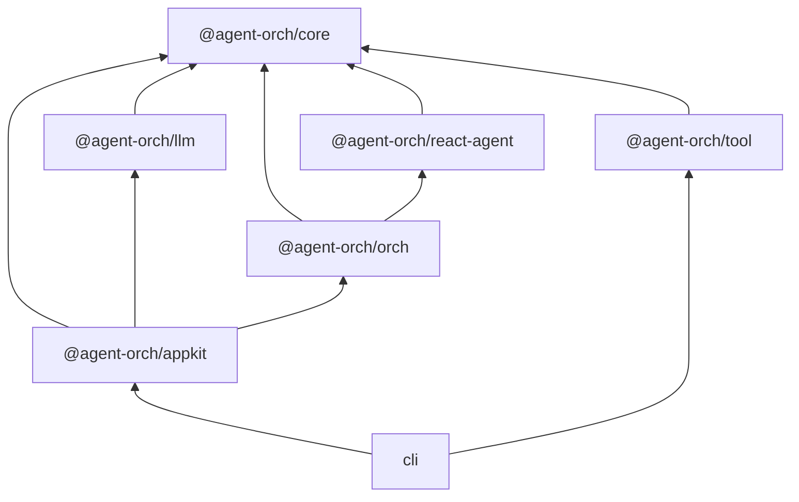

# Agent Orch


**A orch framework for orchestrating AI Agents — unifying LLMs, tools, and collaboration patterns under one control plane.**

---

## Why Agent Orch?

- **Build from scratch** — Use it to easily implement the agent orchestration layer, enabling lower-cost and higher-quality Agent Orch engineering.
- **Atomic design** — Packages like LLM, ReAct Agent, and Tool can be used independently. Start simple, compose as you grow.
- **Business-adaptive** — Different businesses need different harnesses. Flexible orchestration nesting lets you build the orch that fits your use case.

## Features

- **3 Orchestration Patterns** — SingleAgent, PlannerExecutor, and Reflexion
- **Streaming Event System** — 16 event types delivered via `AsyncGenerator`
- **Pluggable Tool System** — Tool definitions with Zod schema validation
- **LLM Provider Abstraction** — Swappable provider layer (currently OpenAI)
- **Recursive Nested Orchestration** — Compose orchestrations within orchestrations
- **Automatic Context Compression** — Keep conversations within token limits transparently
- **Tool Confirmation Mechanism** — Human-in-the-loop approval before tool execution
- **File-Based Session Persistence** — Save and restore agent sessions to disk
- **Rich Message Abstraction** — Provider-agnostic Message abstract class with MessageFactory for dependency inversion across LLM providers.

## Architecture



## Quick Start

### Install

```bash
pnpm add @agent-orch/appkit @agent-orch/tool
```

### Usage

```typescript
import { defineConfig, AgentOrch } from "@agent-orch/appkit";

const config = defineConfig({
  orch: {
    type: "singleAgent",
  },
});

const orch = new AgentOrch(config);

for await (const event of orch.chatStream("Hello, agent!")) {
  console.log(event.type, event.data);
}
```

## Packages

| Package | Description |
| --- | --- |
| `@agent-orch/core` | Core types, interfaces, and utilities |
| `@agent-orch/llm` | LLM provider implementations |
| `@agent-orch/react-agent` | ReAct agent runtime |
| `@agent-orch/orch` | Orchestration patterns engine |
| `@agent-orch/tool` | Built-in reusable tools |
| `@agent-orch/appkit` | High-level application API |

## Design Principles

| Principle | Description |
| --- | --- |
| **Atomic** | ReAct Agent, each Tool, and AppKit can be published and used as standalone packages. Easy to start small and grow. |
| **Template-based** | Built-in orchestration templates (SingleAgent, PlannerExecutor, Reflextion) provide best-practice patterns for reuse. |
| **Streaming-first** | `AsyncGenerator` is the universal transport. Every component yields events incrementally for real-time UIs. |
| **Provider-agnostic** | The `LLM` interface and `Message` abstract class decouple agent logic from specific LLM SDKs. |

## Development

### Prerequisites

- Node.js >= 20
- pnpm 9.15

### Setup

```bash
git clone https://github.com/IanYu-Tree/agent-orch.git
cd agent-orch
pnpm install
pnpm build
```

### Scripts

| Script | Description |
| --- | --- |
| `pnpm build` | Build all packages |
| `pnpm test` | Run the test suite |
| `pnpm dev` | Start development mode with watch |
| `pnpm lint` | Lint the codebase |
| `pnpm typecheck` | Run TypeScript type checking |

## Roadmap

### Orchestration Patterns

- [ ] **Main-Sub** — Hierarchical task delegation where a main agent orchestrates multiple sub-agents for complex workflows
- [ ] **Workflow** — Structured multi-step process execution with defined stages and transitions
- [ ] **Team** — Multi-agent collaboration with role-based coordination and shared context

### Applications

- [ ] **Web UI** — Browser-based interface for visual agent interaction and monitoring
- [ ] **Studio** — Visual configuration generator for building and customizing Agent Orches without coding

## Documentation

The documentation site is currently under development. To view the documentation locally:

```bash
git clone https://github.com/IanYu-Tree/agent-orch.git
cd agent-orch
pnpm install
pnpm docs:dev
```

Then open http://localhost:5173 in your browser.

The documentation includes:
- **Guide** — Getting started, project structure, configuration
- **Concepts** — Architecture, agents, orchestration patterns
- **Advanced** — Custom tools, custom patterns, nested orchestration
- **API Reference** — Complete API documentation

## License

[MIT](./LICENSE)
