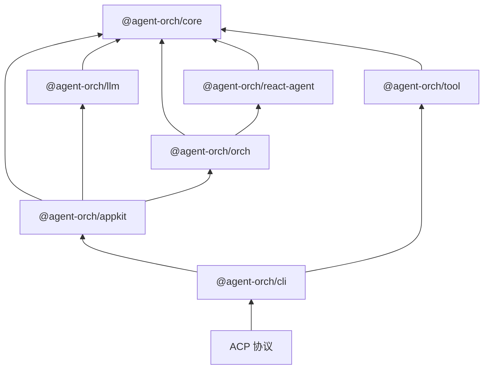

# Agent Orch 🎭

[](https://github.com/IanYu-Tree/agent-orch/actions)
[](./LICENSE)
[](https://nodejs.org)
[](https://www.typescriptlang.org)
[](https://agentclientprotocol.com)

**一个强大的 AI Agent 编排框架 —— 将 LLM、工具和协作模式统一到一个控制平面。现已支持完整的 [ACP (Agent Client Protocol)](https://agentclientprotocol.com)，可与 IDE 无缝集成！**

[English](./README.md) | 简体中文

---

## ✨ 为什么选择 Agent Orch？

- **🚀 IDE 原生体验** —— 完整的 ACP 协议支持，让你的 Agent 直接接入 VS Code、Cursor 和任何兼容 ACP 的 IDE
- **🔧 从零构建** —— 用于轻松实现 Agent 编排层，实现更低成本、更高质量的 Agent Orch 工程
- **🧩 原子化设计** —— LLM、ReAct Agent 和 Tool 等包可以独立使用。从简单开始，按需组合
- **🏢 业务自适应** —— 不同业务需要不同的 harness。灵活的编排嵌套让你可以构建适合你业务场景的编排

---

## 🎯 新功能：ACP 协议支持

Agent Orch 现已实现 **[Agent Client Protocol (ACP)](https://agentclientprotocol.com)** —— 一个用于 AI Agent 与 IDE 集成的开放标准。

### 这意味着什么？

```bash
# 启动 ACP 服务器并连接你的 IDE！
npx @agent-orch/cli acp
```

你的 Agent 现在可以：
- 💬 直接在 VS Code / Cursor / Windsurf 中聊天
- 🔧 在用户确认下执行工具
- 📁 无缝访问工作区文件
- 🔄 实时流式响应
- 💾 跨对话持久化会话

### 快速 ACP 设置

```bash
# 安装 CLI
npm install -g @agent-orch/cli

# 配置你的 LLM 提供商
mkdir -p ~/.agent-orch
cat > ~/.agent-orch/.agent-orch.json << 'EOF'
{
  "llm": {
    "apiKey": "your-api-key",
    "modelId": "openai/gpt-4o"
  },
  "defaultOrchId": "single"
}
EOF

# 启动 ACP 服务器（stdio 模式用于 IDE）
npx @agent-orch/cli acp

# 或使用 HTTP 模式用于 Web 客户端
npx @agent-orch/cli acp --http --port=3000
```

### 通过配置自定义编排

```json
{
  "llm": { "apiKey": "sk-...", "modelId": "openai/gpt-4o" },
  "defaultOrchId": "custom",
  "orchs": [
    { "id": "custom", "path": "./my-orchs/single-agent.ts" },
    { "id": "team", "path": "./my-orchs/team-orch.ts" }
  ]
}
```

你的编排配置将在启动时自动加载！无需修改代码。

---

## 🚀 特性

### 核心能力
- **3 种编排模式** —— SingleAgent、PlannerExecutor 和 Reflexion
- **流式事件系统** —— 16 种事件类型通过 `AsyncGenerator` 传递
- **可插拔工具系统** —— 带有 Zod 模式验证的工具定义
- **LLM 提供商抽象** —— 可互换的提供商层（支持 OpenAI、Anthropic 等）
- **递归嵌套编排** —— 在编排中组合编排
- **自动上下文压缩** —— 透明地将对话保持在 token 限制内
- **工具确认机制** —— 在工具执行前进行人工确认
- **基于文件的会话持久化** —— 将 Agent 会话保存到磁盘并恢复

### ACP 协议特性
- **🔌 双传输模式** —— stdio（用于 IDE 插件）和 HTTP（用于 Web 客户端）
- **📡 实时流式** —— 基于 UUID 去重的增量文本增量
- **🛠️ 工具调用支持** —— 完整的工具生命周期及开始/结束通知
- **💭 思考流** —— 将推理显示与最终输出分离
- **📂 会话管理** —— 创建、加载、列出和恢复会话
- **🎛️ 模式切换** —— 在对话中切换编排模式

---

## 📦 架构



---

## 🏁 快速开始

### 安装

```bash
pnpm add @agent-orch/appkit @agent-orch/tool
```

### 基本使用

```typescript
import { defineConfig, AgentOrch } from "@agent-orch/appkit";

const config = defineConfig({
  orch: {
    type: "singleAgent",
  },
});

const orch = new AgentOrch(config);

for await (const event of orch.chatStream("Hello, agent!")) {
  console.log(event.type, event.data);
}
```

### ACP 服务器使用

```typescript
import { AgentOrch } from "@agent-orch/appkit";
import { startStdioACPServer } from "@agent-orch/cli/acp-server";

const orch = new AgentOrch({
  orchs: getDefaultOrchs(),
  defaultOrchId: "single",
});

// 启动 ACP 服务器用于 IDE 集成
startStdioACPServer({ orch });
```

---

## 📚 包

| 包名 | 描述 | 版本 |
| --- | --- | --- |
| `@agent-orch/core` | 核心类型、接口和工具 | [](https://www.npmjs.com/package/@agent-orch/core) |
| `@agent-orch/llm` | LLM 提供商实现 | [](https://www.npmjs.com/package/@agent-orch/llm) |
| `@agent-orch/react-agent` | ReAct Agent 运行时 | [](https://www.npmjs.com/package/@agent-orch/react-agent) |
| `@agent-orch/orch` | 编排模式引擎 | [](https://www.npmjs.com/package/@agent-orch/orch) |
| `@agent-orch/tool` | 内置可复用工具 | [](https://www.npmjs.com/package/@agent-orch/tool) |
| `@agent-orch/appkit` | 高级应用 API | [](https://www.npmjs.com/package/@agent-orch/appkit) |
| `@agent-orch/cli` | 带 ACP 服务器支持的 CLI | [](https://www.npmjs.com/package/@agent-orch/cli) |

---

## 🎨 设计原则

| 原则 | 描述 |
| --- | --- |
| **ACP 原生** | 对 Agent Client Protocol 的一流支持，实现无缝 IDE 集成 |
| **原子化** | ReAct Agent、每个 Tool 和 AppKit 都可以作为独立包发布和使用。易于从小规模开始并扩展。 |
| **基于模板** | 内置编排模板（SingleAgent、PlannerExecutor、Reflextion）提供最佳实践模式供复用。 |
| **流式优先** | `AsyncGenerator` 是通用传输方式。每个组件都增量产生事件，用于实时 UI。 |
| **与提供商无关** | `LLM` 接口和 `Message` 抽象类将 Agent 逻辑与特定 LLM SDK 解耦。 |

---

## 🛠️ 开发

### 前置要求

- Node.js >= 20
- pnpm 9.15

### 设置

```bash
git clone https://github.com/IanYu-Tree/agent-orch.git
cd agent-orch
pnpm install
pnpm build
```

### 脚本

| 脚本 | 描述 |
| --- | --- |
| `pnpm build` | 构建所有包 |
| `pnpm test` | 运行测试套件 |
| `pnpm dev` | 以 watch 模式启动开发 |
| `pnpm lint` | 检查代码规范 |
| `pnpm typecheck` | 运行 TypeScript 类型检查 |

---

## 🗺️ 路线图

### 编排模式

- [ ] **Main-Sub** —— 分层任务委托，主 Agent 协调多个子 Agent 处理复杂工作流
- [ ] **Workflow** —— 具有定义阶段和转换的结构化多步骤流程执行
- [ ] **Team** —— 基于角色的协调和共享上下文的多 Agent 协作

### ACP 协议

- [x] **核心协议** —— 初始化、会话、提示
- [x] **流式传输** —— 实时文本增量
- [x] **工具调用** —— 完整的工具生命周期
- [ ] **权限** —— 用户审批工作流
- [ ] **嵌套** —— 嵌套编辑建议

### 应用

- [x] **带 ACP 的 CLI** —— 命令行 ACP 服务器
- [ ] **Web UI** —— 用于可视化 Agent 交互的基于浏览器的界面
- [ ] **Studio** —— 用于构建和自定义 Agent Orch 的可视化配置生成器

---

## 📖 文档

文档站点目前正在开发中。要在本地查看文档：

```bash
git clone https://github.com/IanYu-Tree/agent-orch.git
cd agent-orch
pnpm install
pnpm docs:dev
```

然后在浏览器中打开 http://localhost:5173。

文档包括：
- **指南** —— 入门、项目结构、配置
- **概念** —— 架构、Agent、编排模式
- **ACP 集成** —— IDE 设置、协议详情、自定义编排
- **高级** —— 自定义工具、自定义模式、嵌套编排
- **API 参考** —— 完整的 API 文档

---

## 🤝 贡献

我们欢迎贡献！请查看我们的 [贡献指南](./CONTRIBUTING.md) 了解详情。

---

## 📄 许可证

[MIT](./LICENSE) © Ian Yu

---

## 🌟 Star 历史

[](https://star-history.com/#IanYu-Tree/agent-orch&Date)

---

<p align="center">
  <sub>用 ❤️ 为 AI Agent 社区构建</sub>
</p>
