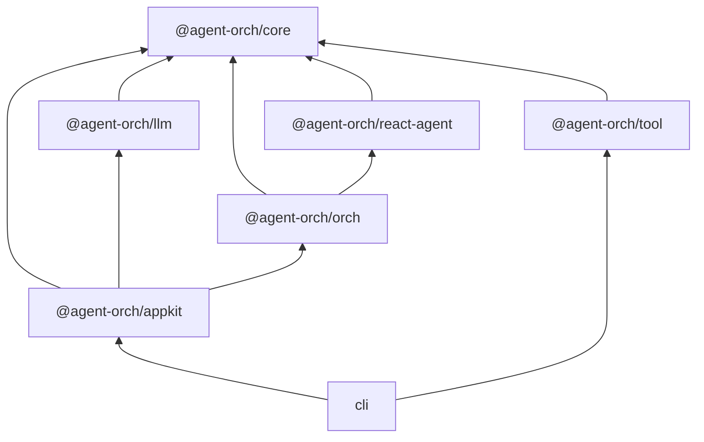

# Agent Orch


**一个用于编排 AI Agent 的框架 —— 将 LLM、工具和协作模式统一到一个控制平面。**

[English](./README.md) | 简体中文

---

## 为什么选择 Agent Orch？

- **从零构建** —— 用于轻松实现 Agent 编排层，实现更低成本、更高质量的 Agent Orch 工程。
- **原子化设计** —— LLM、ReAct Agent 和 Tool 等包可以独立使用。从简单开始，按需组合。
- **业务自适应** —— 不同业务需要不同的 harness。灵活的编排嵌套让你可以构建适合你业务场景的编排。

## 特性

- **3 种编排模式** —— SingleAgent、PlannerExecutor 和 Reflexion
- **流式事件系统** —— 16 种事件类型通过 `AsyncGenerator` 传递
- **可插拔工具系统** —— 带有 Zod 模式验证的工具定义
- **LLM 提供商抽象** —— 可互换的提供商层（当前支持 OpenAI）
- **递归嵌套编排** —— 在编排中组合编排
- **自动上下文压缩** —— 透明地将对话保持在 token 限制内
- **工具确认机制** —— 在工具执行前进行人工确认
- **基于文件的会话持久化** —— 将 Agent 会话保存到磁盘并恢复
- **丰富的消息抽象** —— 与提供商无关的 Message 抽象类，通过 MessageFactory 实现跨 LLM 提供商的依赖倒置。

## 架构



## 快速开始

### 安装

```bash
pnpm add @agent-orch/appkit @agent-orch/tool
```

### 使用

```typescript
import { defineConfig, AgentOrch } from "@agent-orch/appkit";

const config = defineConfig({
  orch: {
    type: "singleAgent",
  },
});

const orch = new AgentOrch(config);

for await (const event of orch.chatStream("Hello, agent!")) {
  console.log(event.type, event.data);
}
```

## 包

| 包名 | 描述 |
| --- | --- |
| `@agent-orch/core` | 核心类型、接口和工具 |
| `@agent-orch/llm` | LLM 提供商实现 |
| `@agent-orch/react-agent` | ReAct Agent 运行时 |
| `@agent-orch/orch` | 编排模式引擎 |
| `@agent-orch/tool` | 内置可复用工具 |
| `@agent-orch/appkit` | 高级应用 API |

## 设计原则

| 原则 | 描述 |
| --- | --- |
| **原子化** | ReAct Agent、每个 Tool 和 AppKit 都可以作为独立包发布和使用。易于从小规模开始并扩展。 |
| **基于模板** | 内置编排模板（SingleAgent、PlannerExecutor、Reflextion）提供最佳实践模式供复用。 |
| **流式优先** | `AsyncGenerator` 是通用传输方式。每个组件都增量产生事件，用于实时 UI。 |
| **与提供商无关** | `LLM` 接口和 `Message` 抽象类将 Agent 逻辑与特定 LLM SDK 解耦。 |

## 开发

### 前置要求

- Node.js >= 20
- pnpm 9.15

### 设置

```bash
git clone https://github.com/IanYu-Tree/agent-orch.git
cd agent-orch
pnpm install
pnpm build
```

### 脚本

| 脚本 | 描述 |
| --- | --- |
| `pnpm build` | 构建所有包 |
| `pnpm test` | 运行测试套件 |
| `pnpm dev` | 以 watch 模式启动开发 |
| `pnpm lint` | 检查代码规范 |
| `pnpm typecheck` | 运行 TypeScript 类型检查 |

## 路线图

### 编排模式

- [ ] **Main-Sub** —— 分层任务委托，主 Agent 协调多个子 Agent 处理复杂工作流
- [ ] **Workflow** —— 具有定义阶段和转换的结构化多步骤流程执行
- [ ] **Team** —— 基于角色的协调和共享上下文的多 Agent 协作

### 应用

- [ ] **Web UI** —— 基于浏览器的界面，用于可视化的 Agent 交互和监控
- [ ] **Studio** —— 可视化配置生成器，无需编码即可构建和自定义 Agent Orch

## 文档

文档站点目前正在开发中。要在本地查看文档：

```bash
git clone https://github.com/IanYu-Tree/agent-orch.git
cd agent-orch
pnpm install
pnpm docs:dev
```

然后在浏览器中打开 http://localhost:5173。

文档包括：
- **指南** —— 入门、项目结构、配置
- **概念** —— 架构、Agent、编排模式
- **高级** —— 自定义工具、自定义模式、嵌套编排
- **API 参考** —— 完整的 API 文档

## 许可证

[MIT](./LICENSE)
