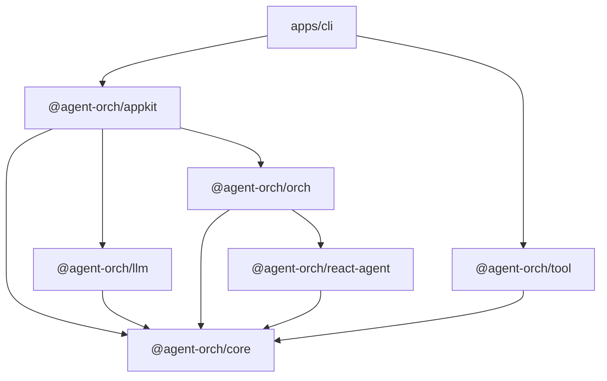

# Project Structure

Agent Orch is organized as a pnpm monorepo. Each package has a focused responsibility, and clear dependency boundaries keep the architecture modular.

## Package Overview

| Package | Path | Description |
| --- | --- | --- |
| **core** | `packages/core` | Base types, interfaces, and shared utilities used by every other package. |
| **llm** | `packages/llm` | LLM provider adapters (currently OpenAI Responses API) with unified streaming interface. |
| **react-agent** | `packages/react-agent` | ReAct (Reasoning + Acting) agent runtime — the single-agent execution loop. |
| **orch** | `packages/orch` | Orchestration layer implementing `singleAgent`, `plannerExecutor`, and `reflextion` patterns. |
| **tool** | `packages/tool` | Built-in reusable tool definitions (currently Todo tools: set-todo, get-todo) with Zod schemas. |
| **appkit** | `packages/appkit` | Application-level facade — `defineConfig`, `AgentOrch`, session management. |
| **cli** | `apps/cli` | Terminal chat application built with Ink (React for CLI) for local development and experimentation. |

## Dependency Graph



Key observations:

- **core** sits at the bottom of the graph — it has zero internal dependencies.
- **orch** depends on **react-agent** because every orchestration pattern ultimately delegates to one or more ReAct agent loops.
- **appkit** aggregates **core**, **llm**, and **orch** into a single developer-facing API surface.
- **cli** is a leaf application that composes **appkit** with the built-in **tool** set.

## Build System

| Tool | Purpose |
| --- | --- |
| **pnpm workspaces** | Monorepo package linking and dependency management. |
| **Turborepo** | Parallel, cached task execution (`build`, `test`, `lint`) across all packages. |
| **Rslib** | Library bundler producing dual **ESM** and **CJS** output for every package. |

A single `pnpm build` at the repository root triggers Turborepo, which resolves the dependency graph and builds packages in the correct topological order. Incremental builds are cached — only packages that changed (or whose dependencies changed) are rebuilt.

## Testing

All packages use **Vitest** as the test runner:

```bash
pnpm test          # run all tests across the monorepo
pnpm test --filter @agent-orch/core   # run tests for a single package
```

Vitest is configured at the root level with per-package overrides where necessary. Tests live alongside source files in `__tests__` directories or as `*.test.ts` files.

## Next Steps

- [Configuration](./configuration.md) — learn how to configure orchestrations, agents, and LLM providers.
- [Introduction](./introduction.md) — revisit the high-level overview and design principles.
